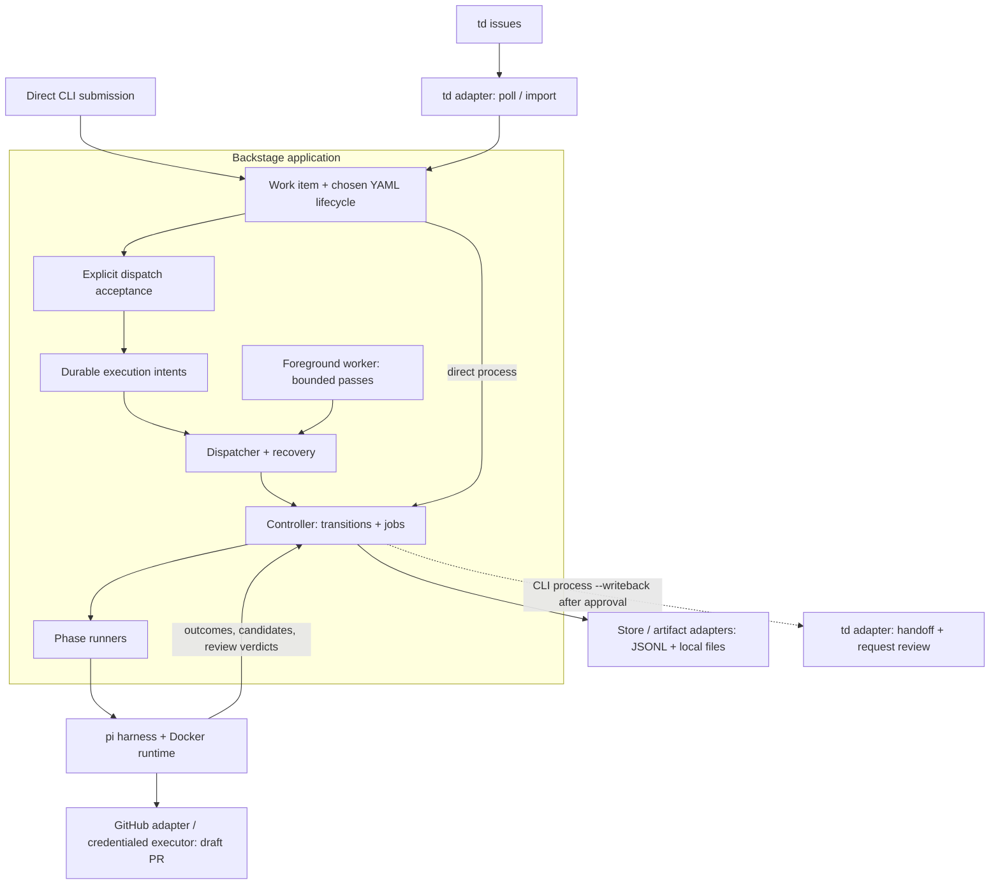

# Backstage

Backstage runs explicitly accepted work through a durable local queue and a lifecycle written in YAML. You submit an assignment, accept it for execution, and let a worker carry it through implementation, review, and any recorded human decisions. Backstage keeps the work state, execution history, and artifacts so progress can be inspected and interrupted runs reconciled.

The included live path uses pi in Docker to implement a repository change, publishes a GitHub draft pull request, then runs a fresh independent review. The default lifecycle ends with an independently approved draft ready for human disposition. [td](https://github.com/marcus/td) is an optional integration for importing issues and writing back a handoff; direct submission and execution do not require td.

This project is not the CNCF Backstage developer portal.

## How work moves

Backstage owns execution of an assignment. A tracker can own the surrounding backlog, priorities, and issue review. Importing a tracker issue creates a Backstage work item; it does not automatically authorize execution.

1. **Submit.** Use `submit` directly, or import through the td adapter. Admission records the target, source identity, and chosen workflow. Idempotent resubmission cannot retarget an assignment.
2. **Accept.** `dispatch accept` records an execution intent: the queue entry, execution mode, and retry policy. The dispatcher only consumes accepted intents.
3. **Run.** `dispatch pass` makes one bounded pass; `dispatch run` repeats passes in a foreground worker. The controller follows the workflow's declared transitions and dispatches its jobs.
4. **Stop or continue.** The lifecycle determines whether to implement again, review, wait for a human decision, or finish. Recovery reconciles recorded runs and external actions before more work starts.



The diagram shows responsibilities. On the live default path, implementation produces a patch, a separate credentialed executor publishes the draft, and a fresh reviewer container inspects the candidate. Review findings can send the same assignment through bounded revisions. The [Fractal model](docs/diagrams/fractal/README.md) provides more detailed architecture and sequence views.

Queue status and work lifecycle state are separate. An intent can be `queued`, `running`, `waiting`, `delayed`, `uncertain`, or `blocked`, then close as `completed`, `cancelled`, or `exhausted`. A completed intent means the work reached a terminal workflow state, which can include cancellation. Human waits need `decide`; uncertain runs and durable blocks need operator attention. Automatic failure retries are bounded and disabled by default in the example pack.

There is one local dispatcher owner per state store. The worker runs in the foreground; use an external supervisor to keep it running. Its polling consumes the execution queue, not tracker issues. `td poll` is a separate ingestion command. `process WORK_ID` offers the same controller journey directly for work without an active execution intent; it refuses work already owned by the dispatcher.

## Try the queue without external services

Ruby 4.0 or newer, Bundler, and `jq` for the shell example. Docker, td, and tokens are not required for this path. Run from the repository root:

```sh
bundle install
bin/backstage config check --pack packs/example --json
work_id=$(bin/backstage --json submit --pack packs/example --target widgets --title "Example" --description "Prove it" | jq -r .id)
bin/backstage dispatch accept "$work_id" --pack packs/example --json
bin/backstage dispatch pass --pack packs/example --work "$work_id" --json
bin/backstage dispatch show "$work_id" --pack packs/example --json
bin/backstage show "$work_id" --json
```

This runs the fake implementation and review through the real lifecycle, state, and artifact machinery, without model or GitHub calls. For an ongoing worker, replace the pass with `bin/backstage dispatch run --pack packs/example --json`. To try direct execution, submit a different assignment and use `bin/backstage process WORK_ID --pack packs/example --json` without accepting it into the queue.

`packs/example` targets the fictional `example/widgets` repository. Structured state defaults to `~/.backstage/state.jsonl` and artifacts to `~/.backstage/artifacts`. `--state`, `--artifacts`, `BACKSTAGE_STATE`, and `BACKSTAGE_ARTIFACTS` override those paths. Manual submissions deduplicate by a key derived from the title unless you provide `--idempotency-key`.

Global `--json` and `--jsonl` work before or after the command. The [operator guide](docs/guides/active/operator-guide.md) covers queue controls, `transition`, `decide`, `recover`, `cancel`, and activity inspection. Nothing in the CLI waits for a keypress.

## Adapters and configuration

The Ruby application owns lifecycle transitions, policy, routing, idempotency, execution accounting, and audit state. Adapters handle external systems and local infrastructure. The CLI is a thin noninteractive surface over the library; `require "backstage"` is the library entry point.

| Boundary | Included implementation |
|---|---|
| Work ingestion and tracker writeback | td client, trigger polling, and work-source adapter; direct CLI submission also enters the core |
| Repository operations and review changes | GitHub repository and draft pull request adapters, with the container repository executor |
| Agent harness and output interpretation | pi invocation and stream interpreter; the live runner currently uses OpenRouter credentials |
| Worker execution and liveness | Docker runtime and presence adapter; fake runners/runtime for local proof and tests |
| State and activity | JSONL store behind the Store port, with guarded atomic record and history commits |
| Artifacts, context, and worker requests | Local files for artifacts, read-only repository context, and the agent request channel |
| Dispatcher ownership, time, and credentials | Local file ownership lock, system clock, and environment credential broker |

The explicit interfaces in [`ports/`](lib/backstage/ports/) cover storage, dispatcher ownership, clocks, runtime presence, agent requests, capture, and stream interpretation. Other seams, including the harness, runtime, and work source, use injected Ruby objects and their method contracts. [`bootstrap/system.rb`](lib/backstage/bootstrap/system.rb) wires the included implementations. Another tracker, harness, runtime, or store requires adapter code and composition/configuration changes; changing a YAML `kind` alone does not install an integration. No other tracker adapter ships today.

A deployment pack describes adapter settings, worker image, credential references, and the lifecycles on offer. A target binds one repository, its source routing, instructions, and optional read-only context checkouts. A job bundle is compiled and stored for each run, recording what the agent was given.

The current pack format still requires `trigger.td_workspace` and `trigger.source_instance` on every target, including targets used by manual submissions. Those fields bind routing identity; direct execution does not invoke td or require a td installation. This is a current configuration limit of the included integration.

Keep your deployment pack outside this repository, replace the fictional repository and context settings, and pass its directory with `--pack`. `bin/backstage config check --pack PATH --json` compiles the pack and its workflows. The [configuration model](docs/guides/active/config-model.md) documents the file shape. Routing and the workflow digest are fixed at admission; later processing cannot silently change them.

The example pack includes `independent-review` as its default, plus `minimal` and `human-gated-change`. These are different lifecycles; the live draft and external handoff rules still apply. A simpler lifecycle does not grant new publication authority.

## Publish a draft

A real run needs Docker, a local build of the worker image, a fine-grained GitHub token for the designated repository, and `OPENROUTER_API_KEY` for the included pi path. First configure and validate your own pack, then submit a new assignment to its target. Accept and consume it with `--publish-draft` at both steps:

```sh
docker build --tag backstage-worker:0.1.0 .
export GITHUB_TOKEN          # contents and pull requests on the designated repository
export OPENROUTER_API_KEY
work_id=$(bin/backstage submit --pack /path/to/your-pack --target TARGET --title "Repository change" --description "Describe the change and acceptance criteria" --json | jq -r .id)
bin/backstage dispatch accept "$work_id" --pack /path/to/your-pack --publish-draft --json
bin/backstage dispatch pass --pack /path/to/your-pack --work "$work_id" --publish-draft --json
```

For a continuing live worker, use `dispatch run --publish-draft`. A worker without that flag leaves real intents queued; a live worker still executes fake intents as fake. An existing acceptance cannot be upgraded by adding the flag later. For direct execution of an assignment outside the queue, use `process WORK_ID --pack PATH --publish-draft`.

The image pins `node:24-bookworm-slim` by digest, pi at 0.84.3, and Go 1.27.0 with architecture-specific checksums. It also contains `git`, `gh`, and the repository worker. Repositories, prompts, and credentials arrive with the job.

Pack YAML holds credential references, not token values. Only environment-variable names are passed into Docker arguments. The example mapping is:

```yaml
credentials:
  repository_default: github
  broker:
    github:
      source_env: GITHUB_TOKEN
      runtime_env: GH_TOKEN
    openrouter:
      source_env: OPENROUTER_API_KEY
      runtime_env: OPENROUTER_API_KEY
```

Use a token restricted to the designated repository. Backstage cannot read a token and tell which repositories it covers, so that scope is an operator precondition.

## Optional td integration

With td installed and a pack target pointing at its workspace, import open issues labeled `agent-ready`, or select an issue explicitly:

```sh
bin/backstage td poll --pack /path/to/your-pack --target TARGET --json
bin/backstage submit --td-issue ISSUE_ID --pack /path/to/your-pack --target TARGET --json
```

These commands admit work; accept each returned work item separately to queue it. Backstage keeps its own execution records and lifecycle rather than relying on td status to track a worker.

Tracker writeback is explicit: `process WORK_ID --pack PATH --publish-draft --writeback` can post a td handoff and request td review once completion has recorded authority from an independent verdict. Use it for td-backed work. `dispatch run` does not automatically write back to td. The td review request is a tracker action separate from Backstage's independent agent review; neither merges the draft.

## Execution boundaries

The current live path publishes draft pull requests. `--publish-draft` does not merge, push a default branch, deploy, or notify anyone. Deployment and other operational effects are not implemented.

The agent checkout has no repository credentials. It produces a size-bounded patch recording its base, branch, and digest. A separate credentialed executor mounts only that patch, creates a fresh checkout, and rechecks origin, branch, base, and draft-only action before committing or pushing.

Actor authority comes from where a request entered. An operator may act as a person or as the system. Worker requests go through a run-scoped channel as `agent` or `reviewer`; a worker cannot approve its own change. Implementation and review use distinct runner objects and fresh containers, and review authority is clone-only. Independent approval is bound to the candidate digest; new candidate content invalidates an earlier approval. The [operator guide](docs/guides/active/operator-guide.md#actors-and-the-local-trust-boundary) describes the trusted local CLI boundary and decision rules.

Transitions commit state, history, decisions, and requested jobs together, guarded by the work item's revision. Late results from cancelled or replaced runs are fenced. GitHub and td writes use preflight reconciliation and a persisted external-action ledger: retries reconcile the recorded branch, draft, and handoff instead of blindly repeating them.

## Development

```sh
bundle exec rake test
BACKSTAGE_DOCKER_TEST=1 bundle exec rake test
bin/backstage config check --pack packs/example --json
```

The default suite does not use the network, td, GitHub, or a model provider. Docker tests are opt-in and need the worker image. Run `scripts/scan-secrets` before publishing anything that might carry a credential value.

Schemas in `schemas/` are versioned (`*-v1.json`, plus v2 agent requests and the current run outcome). When a contract changes, add a new file. Do not edit a schema that already has records written against it.

`lib/backstage` is split by boundary:

| Directory | Holds |
|---|---|
| `domain/` | Records, compiled lifecycles, repository authority |
| `application/` | Execution, transitions, recovery |
| `ports/` | Narrow interfaces |
| `adapters/` | td, GitHub, pi, Docker, JSONL, local files, environment, and the fake journey |
| `configuration/` | Deployment pack compilation |
| `contracts/` | Schema validation |
| `surfaces/` | The CLI |
| `bootstrap/system.rb` | Composition root shared by the CLI and any future host |

No gem outside Ruby's standard and default libraries is required beyond the `base64` dependency declared in the gemspec. Adding another runtime dependency is a decision to make explicitly. See [CONTRIBUTING.md](CONTRIBUTING.md) for contribution guidance.

## Status

0.1.0. JSONL and local files provide persistence; pi and Docker are the included live harness and runtime; td is the included tracker integration. The CLI and Ruby library are available today. Additional integrations and process hosts require implementation.

## License

[MIT](LICENSE).
