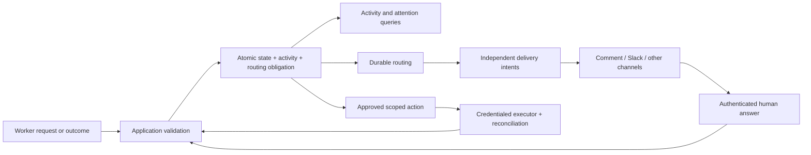

# Durable activity, notifications, and gated actions

Status: slices 1 and 2 implemented on `main` (`td-66e7f9`, 2026-09-09); slices 3 to 5 planned.
Owner: `td-3c93ef` (plan), `td-66e7f9` (slices 1 and 2). Baseline: `55854c2`, 2026-09-09.

## Outcome

An operator can follow an assignment across runs and restarts, understand what caused each
change, receive the same question or result on several configured channels, and answer once.
An agent can propose a deployment or operational repair; Backstage presents the exact action
for human approval and executes it through a scoped adapter after approval. It records evidence
of the result without confusing an agent's success, delivery success, and operational success.

This is the controlling implementation plan for these capabilities. Read this index, then
[activity](activity.md), then [notifications and actions](notifications-and-actions.md).
No service installation, real messages, deploys, or repairs are performed by writing this plan.

## Design decisions

- Backstage owns work state, decisions, effect requests, and their history. Channels and tickets
  carry inputs and projections; an event observation does not by itself authorize a command.
- Activity is an immutable, ordered record and shared query surface. Existing work/run records
  remain operational state. This does not turn the application into a replay-driven event engine.
- Business changes and their activity commit together. A durable routing obligation commits with
  each eligible notification/action source. Network effects happen afterward through the ledger.
- Fan-out is supported from the beginning: one accepted source can produce both a source-record
  comment and a Slack message, with independent delivery state and one underlying decision.
- Deployments and operational repairs are supported product directions, initially requiring a
  human decision bound to an exact action. Default-deny for undeclared capabilities remains;
  deployment is not a permanently forbidden product capability.
- The existing draft-PR path keeps its present enforcement until the scoped action executor and
  approval path are implemented and proven. Do not broaden its `--publish-draft` authority.
- Keep JSONL and a local process first, with no broker, general-purpose event bus, workflow DSL,
  worker pool, or new runtime dependency required by this plan.

## Deferred capabilities: what the architecture permits

| Capability | Assessment | Future changes and seams to preserve |
| --- | --- | --- |
| Cross-project dependencies within a deployment | No structural prohibition. Work items already have independent identities and target bindings. | Add dependency records and an application eligibility check, rechecking bound dependency evidence/revisions atomically at dispatch claim; depend on explicit success/evidence, not generic terminal state. Detect cycles and define cancellation/revision behavior. Each child gets its own target, acceptance, and authority. Never widen one work item's immutable target to cover several projects. |
| Coordination across deployments/stores | Possible, but a separate integration problem. | Authenticated external observations and durable reconciliation; no assumed shared transaction or global sequence across stores. Do not merge client isolation boundaries. |
| Trigger/job priority | Local extension to admission and selection. | Persist resolved priority and stable tiebreak; keep eligibility, due time, and priority separate. Today order is due time then creation time, effectively FIFO for equally due work. |
| Local execution pools | Compatible with the work/transition model, not merely a new runtime adapter. | Split synchronous dispatch/observe, add capacity and bounded per-work/resource claims, keep reconciliation and late-result fencing. Current worker holds local ownership around a serial loop. |
| Multi-host execution pools | Credible future step with larger ownership/storage changes. | Replace PID/local-file authority with leases/fencing and remote runtime presence. A database swap alone is insufficient. |
| New harnesses/context/schedules | Existing adapter boundaries are useful starting points. | Implement contracts against real journeys; scheduling occurrence identity and missed-run policy are core semantics. |
| General non-code work | Needs a bounded core extension. | Current phases/evidence/bundles are code-shaped. Add typed operational actions here; defer arbitrary agent phase registries until the first non-code agent journey needs them. |

Defer coordination, priority, and pools. Preserve stable deployment/work/run identities, explicit
outcome semantics, opaque activity cursors, guarded commits, and authority per action now. Do not
prebuild a dependency graph or a universal resource scheduler to keep that path open.

## Shared architecture

All observers read through the application boundary. The notification/action workers consume
durable obligations, not live subscriptions that miss events during downtime. Core lifecycle
events are unsampled. Debug telemetry is optional and never the approval/audit authority.

## Delivery sequence and acceptance

| Slice | Deliverable | Proof before moving on |
| --- | --- | --- |
| 1. Durable lifecycle activity (landed) | `activity-event-v1`, `Store#commit(activity:)`, `read_activity` cursors, emitters in Engine/WorkflowService/Dispatcher/Recovery/td trigger, `activity list/show/follow`; no legacy import (new system), only a stream start marker | Proven in `activity_store_test`, `activity_emitters_test`, `activity_cli_test`: byte-by-byte truncation walk, forked writers, exact-retry reconciliation, filtered pagination, cursor binding and `cursor_ahead_of_stream`. Independent review closed `td-40e676`, `td-f71f59`, `td-cf98d0`, fixes `td-44a25f` |
| 2. Runtime activity (landed) | `RuntimeCapture` streams, fsynced chunk artifacts, `runtime_streams` checkpoints, Pi and sentinel interpreters, `outcome-v2`, capture coverage on runs, Recovery gap reporting, `capture` pack policy | Proven in `capture_kill_mid_stream_test`, `capture_bounds_proof_test` (64 MiB baseline and thresholds in [activity](activity.md#proof)), `capture_replay_dedupe_test`, `capture_persistence_failure_test`. Independent reviews closed `td-dfe850`/`td-99aea5`; `td-e90467`/`td-bce761`/`td-095cd0` verified by the orchestrator after the final review pass was interrupted |
| 3. Fan-out delivery | Durable routing records, action identity/claims, local recording adapter plus source comment and Slack adapters | One transition and one accepted session-result fixture each fan out; crash/restart and one failed channel never duplicate the successful channel; ambiguous send stays uncertain |
| 4. Questions and replies | Shared attention query, structured answers, trusted entry contexts, channel message mapping; CLI and one authenticated reply adapter | Two channels answer the same decision; exactly one valid continuation, stale/unauthorized/duplicate replies handled; edited approval subject invalidates prior approval |
| 5. Gated operations | Typed action proposal, human approval, scoped executor, result verification and workflow outcomes | Fake deploy/repair without repository job; approval/revocation/race tests; then one configured low-stakes real operation with explicit operator authorization and evidence |

Slices are end-to-end journeys, not permission to build every layer before demonstrating one.
After slice 1, an operator can already inspect meaningful durable activity. After slice 3,
completion can appear on multiple channels. Slice 4 does not require building a graphical UI:
the CLI and shared query provide the first complete surface. Add UI as a client afterward.

Each implementation slice updates its section, runs focused tests and the network-free suite,
validates any pack edits, and gets independent review. Docker changes also require the existing
Docker contract proof. Scan artifacts/docs for credentials before publication. Real connector
proof needs configured destination, scoped credentials, and explicit authorization to send;
fake/local HTTP fixtures establish behavior before that step. Do not claim live proof from mocks.

## Implementation map and compatibility

- Domain: immutable activity, notification/delivery, action/approval records and validation.
- Application: activity query/recording, durable routing, effect coordination, authenticated input;
  integrate with WorkflowService, Engine, Controller, Dispatcher and Recovery.
- Ports: extend Store's atomic activity/query contract; narrow delivery, external-action, and
  authenticated inbound integration contracts. Preserve existing work-source ownership.
- Adapters: JSONL/local artifact capture; recording/fake adapters; td comment and Slack delivery;
  one scoped operational executor. Compose all through `bootstrap/system.rb`.
- Schemas: `activity-event-v1` and `outcome-v2` exist; notification/action/answer contracts are
  next. Introduce new versions of existing request/outcome/bundle contracts where needed. Never
  change produced v1/v2 meanings (`Domain::Outcome.project_v1` is asserted against `outcome-v1`).
- Compatibility: existing records, CLI outputs and draft-only entry points remain readable and
  usable. Legacy runs are labeled as partial history. Existing decisions remain decision-kind
  approval/question records with their original candidate binding; do not reinterpret them as
  approval to deploy. Effective capability previews distinguish configured, implemented, and
  unavailable actions.

## Settled scope and remaining deployment choices

Settled: durable activity, multi-channel fan-out, reply correlation, human-gated deploy/repair,
and the separation of activity from authority. No blanket human approval is required for every
routine notification; approved routing policy authorizes its bounded destination/content class.

Before live proof, select the first actual comment destination and Slack conversation, who may
answer, and one low-stakes operational capability/environment. Those are deployment bindings,
not unresolved architecture. Start with `td` source comments and Slack fixtures as the reference
pair; verify the actual provider APIs during implementation. Email and generic webhooks remain
additional adapters with explicitly declared reconciliation/reply capabilities.

## Implementation handoff, slices 1 and 2

Epic `td-66e7f9` orchestrated nine stories through sub-agents with independent review per slice.
Deliberately skipped: import/migration of pre-activity state (the system has no data to preserve;
a stream start marker labels the boundary), the Docker variant of the kill-mid-stream proof (the
stub-docker child exercises the same pipe, reader, queue and teardown), and a cleaner for orphaned
chunks. Open follow-ups: `td-95c9f7` (idempotent replay ignores `--expect-*`, pre-existing); before
slice 3, decide whether `Store#commit` should return a cursor for its sequences so a delivery
consumer can checkpoint from a commit. Final gates on `main` at `08f5c0e`: `bundle exec rake test`
413 runs, 0 failures; the Docker suite green with 0 skips at `4817176`; `config check` valid;
secret scan clean.

## Planning handoff

Tracking `td-3c93ef` covers this plan and guidance update, not implementation completion.
Baseline constraints are Store#commit's atomic batches; Engine's in-memory events;
Pi parser/runtime accumulated logs; WorkflowService's operator-only decision entry; Dispatcher’s
serial loop and global unresolved-effect assumptions; RepositoryAuthority's draft-only allowlist.
Independent read-only review completed with no blocking findings after clarifying paused-executor
ownership and dependency checks at claim. No runtime code or permissions changed in that planning pass.
